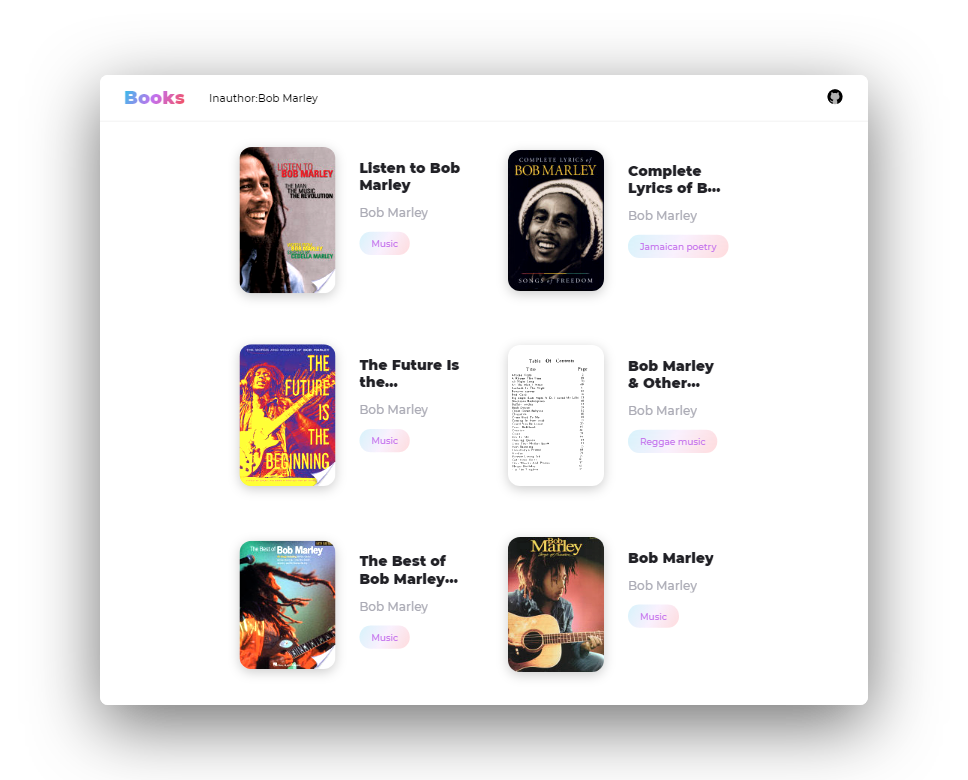
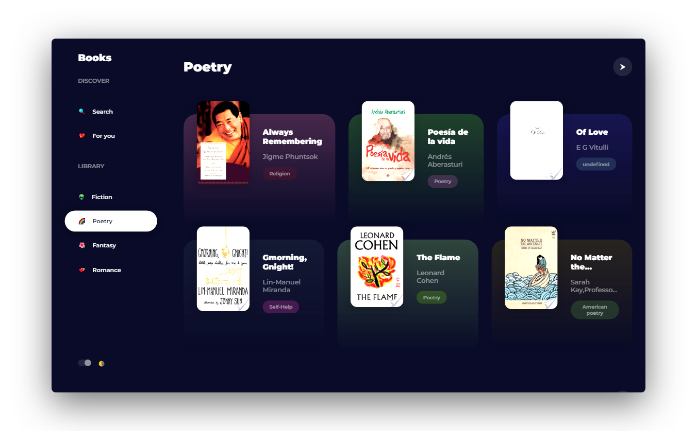

      

#  Books

### 📚 Find books from Google Play Books by [Liyas Thomas](https://github.com/liyasthomas)

   
  
  
   

### Features :sparkles:

:heart: **Lightweight and minimal**: Crafted with minimalistic UI design

:electric_plug: **Real-time search**: Search books by name, author, genre etc...

:zap: **Instant reading**: Click on any book to read it in Google Play Books!

:last_quarter_moon: **Turn off the lights!**: Dark mode to soothe your eyes

---

## Demo

[https://liyasthomas.github.io/books](https://liyasthomas.github.io/books)

* Search books by name, author, genre and etc...
* Collection of curated books just for you!
* Fiction, poetry, fantacy, romancs and many more!
* At night, turn off the lights!

---

## Built with

* **[Chromium](https://github.com/chromium/chromium)** - Thanks for being so fast!
* HTML - For the web framework
* CSS - For styling components
* JavaScript - For magic!

---

## Contributing

Please read [CONTRIBUTING](CONTRIBUTING.md) for details on our [CODE OF CONDUCT](CODE_OF_CONDUCT.md), and the process for submitting pull requests to us.

---

## Continuous Integration

We use [Travis CI](https://travis-ci.com) for continuous integration. Check out our [Travis CI Status](https://travis-ci.com/liyasthomas/books).

---

## Versioning

This project is developed by [Liyas Thomas](https://github.com/liyasthomas) using the [Semantic Versioning specification](https://semver.org). For the versions available, see the [releases on this repository](https://github.com/liyasthomas/books/releases).

---

## Change log

See the [CHANGELOG](CHANGELOG.md) file for details.

---

## Authors

### Lead Developers
* [**Liyas Thomas**](https://github.com/liyasthomas) - *Author*

### Thanks
* [StackOverflow](https://stackoverflow.com)

See the list of [contributors](https://github.com/liyasthomas/books/graphs/contributors) who participated in this project.

---

## License

This project is licensed under the [MIT License](https://opensource.org/licenses/MIT) - see the [LICENSE](LICENSE) file for details.

---

## Acknowledgments

* Hat tip to anyone who's code was used
* Inspirations:
	* [Dribbble](https://dribbble.com)
